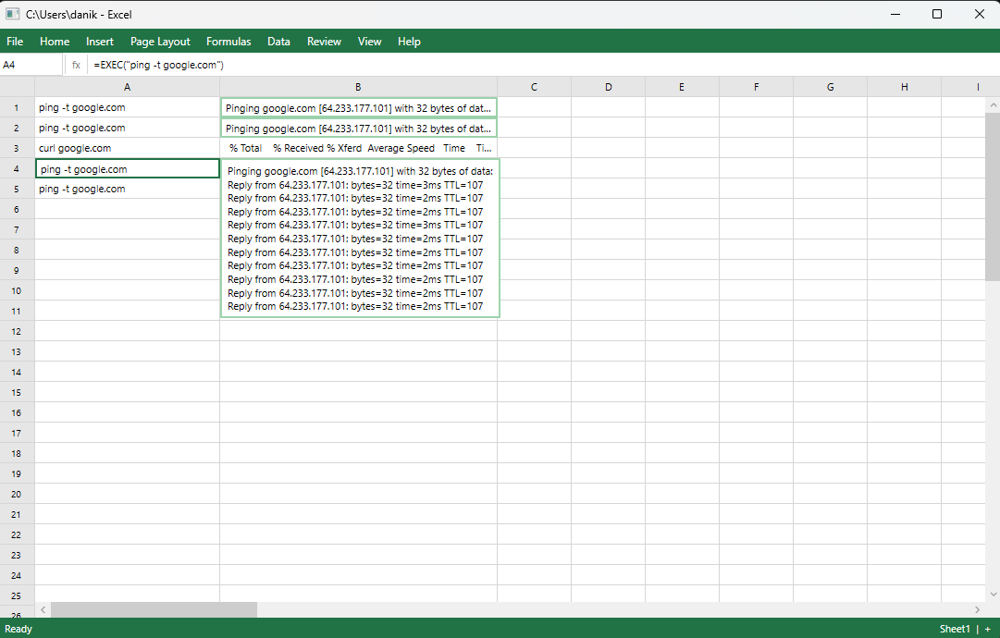

# CellShell

A project made to annoy both TUI and GUI lovers - CLI in the form of excel



## What is this?

CellShell is a WPF application that looks exactly like Excel but is, in fact, a shell. Type commands into column A, get output in column B. You can even pretend to be using excel while doing what you truly loive, using a cli.

Every command is wrapped in the only formula that matters: `=EXEC("your command here")`.

## Features

- **Looks like Excel** — Is it a feature? Debatable
- **Is a terminal** — Type any shell command. `ping`, `curl`, `git`, `dotnet`, etc.
- **Live streaming output** 
- **Concurrent execution** — Run multiple commands at once. Each row is independent. 
- **Expand output** — Double-click any cell to see the full output in a scrollable overlay. Running commands auto-scroll.
- **Shell toggle** — Click `cmd ▾` in the status bar to switch between `cmd.exe` and PowerShell. Formula bar shows `=EXEC()` or `=EXEC.PS()`.
- **Ctrl+C** — Kill the active row's process. Like a real terminal, except it looks like you're editing a spreadsheet.
- **Resizable columns and rows** — Drag to resize, just like the real thing. Double-click a cell to auto-expand.
- **The menus work** — They just don't do what you'd expect. Try Help > Clippy.

## Requirements

- Windows 10/11

## Getting Started

Grab `CellShell.exe` from the [latest release](https://github.com/DHuryn/CellShell/releases/latest) and run it. No install needed.

### Build from source

Requires [.NET 8 SDK](https://dotnet.microsoft.com/download/dotnet/8.0).

```
git clone https://github.com/DHuryn/CellShell.git
cd CellShell
dotnet run
```

Then type a command in cell A1 and press Enter. Pretend you're working on whatever it is people do in excel.

## Usage

| Action | How |
|---|---|
| Run a command | Type in column A, press Enter |
| View full output | Double-click the output cell |
| Kill a process | Select the row, press Ctrl+C |
| Navigate rows | Click any row to select it |
| Resize columns | Drag column header borders |
| Switch shell | Click `cmd ▾` / `pwsh ▾` in status bar |
| Change text size | View > Text Size +/- |

### Debug mode

```
dotnet run -- --debug
```

Writes a log to `cellshell-debug.log` in the output directory.

## Project Structure

```
CellShell/
  Core/
    CellData.cs          # Row state: command, output, status, process handle
    CommandExecutor.cs   # Shell execution with streaming output
    SpreadsheetModel.cs  # Grid logic, formatting, no WPF dependencies
  MainWindow.xaml.cs     # The disguise: canvas rendering, animations, overlays
  App.xaml.cs            # Startup, console attachment, graceful shutdown
  Tests/                 # xUnit tests for CommandExecutor and SpreadsheetModel
```

## FAQ

**Q: Why?**
A: I saw a really cool TUI project and got inspired to make a really bad one. Its not even a TUI anymore, to be more excel-like!
**Q: Does it actually do spreadsheet things?**
A: No. Could it? Probably.

**Q: Can I save my work?**
A: No. It's a terminal. Just scroll up.
